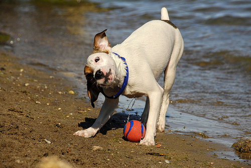

# **Image Captioning**
- Image Captioning Model 
- Based on standard CNN LSTM architecture ( will add attention later too)
- Utilized Pretrained models to extract image features 
- Used Flickr8k dataset
- It works quite simply We Input the image and it outputs descriptive captions
## **Image Captions** <br>
Some examples of Images-Caption pairs in the flickr dataset <br>
<br>
 <br>
<em>**Caption**</em> - White dog playing with a red ball on the shore near the water . <br> 

 <br>
<em>**Caption**</em> - A child in a pink dress is climbing up a set of stairs in an entry way <br>

## **Image Features Extraction** 

Extracted image features using the VGG 16 model

loaded the VGG16 model and restructured the model by Using `model.layers[-2].output` and extracted features from the penultimate layer, omitting the final activation layer, to ensure raw feature representations are obtained as the model was initially designed for classification


```python
from tensorflow.keras.applications.vgg16 import VGG16, preprocess_input
for img_name in tqdm(os.listdir(directory)):
    img_path = directory + '/' + img_name
    image = load_img(img_path, target_size=(224, 224))
    image = img_to_array(image)
    image = image.reshape((1, image.shape[0], image.shape[1], image.shape[2]))
    image = preprocess_input(image)
    feature = model.predict(image, verbose=0)
    image_id = img_name.split('.')[0]
    features[image_id] = feature
```
